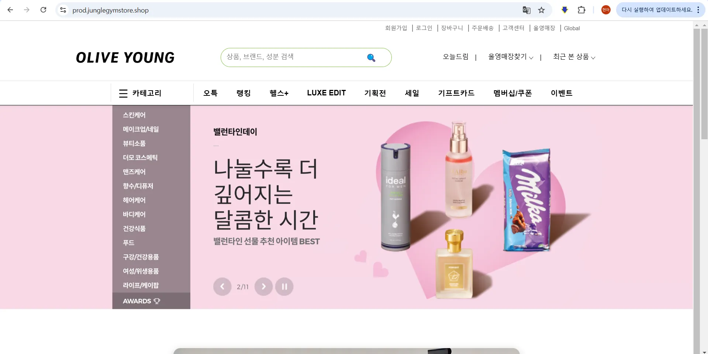
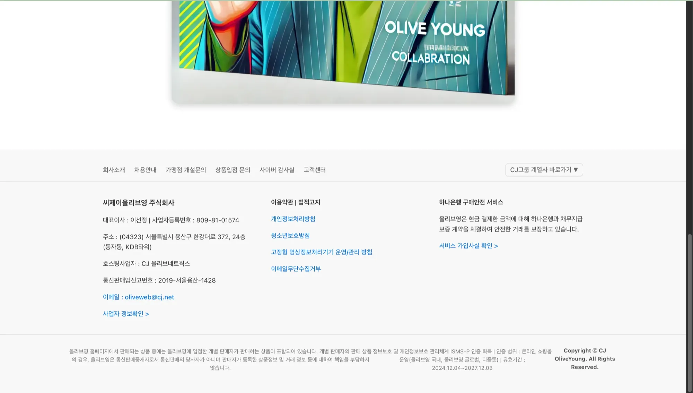
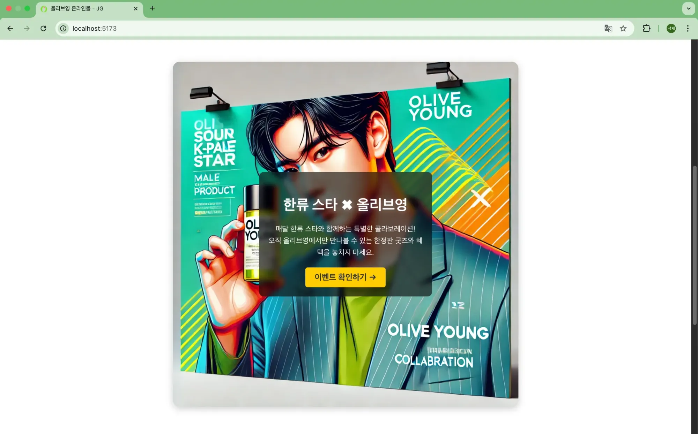
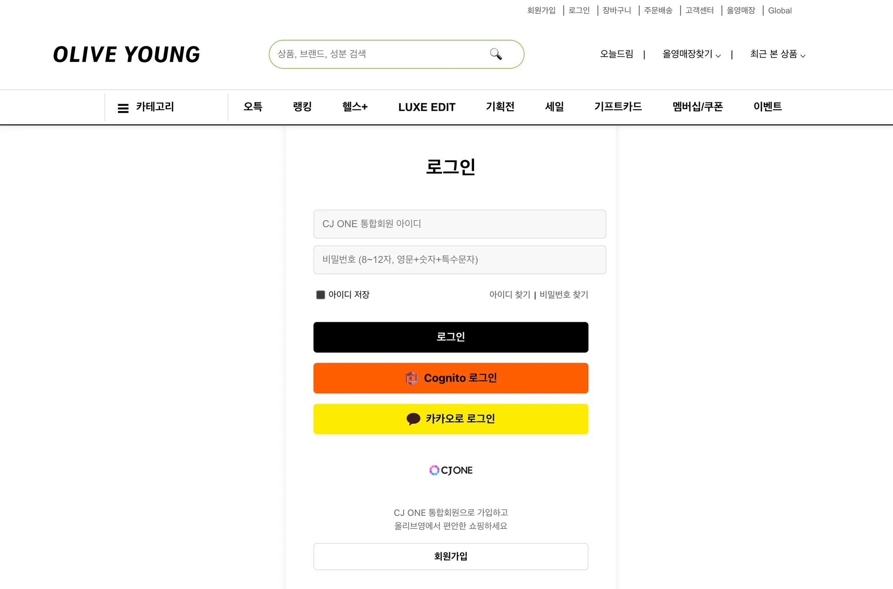
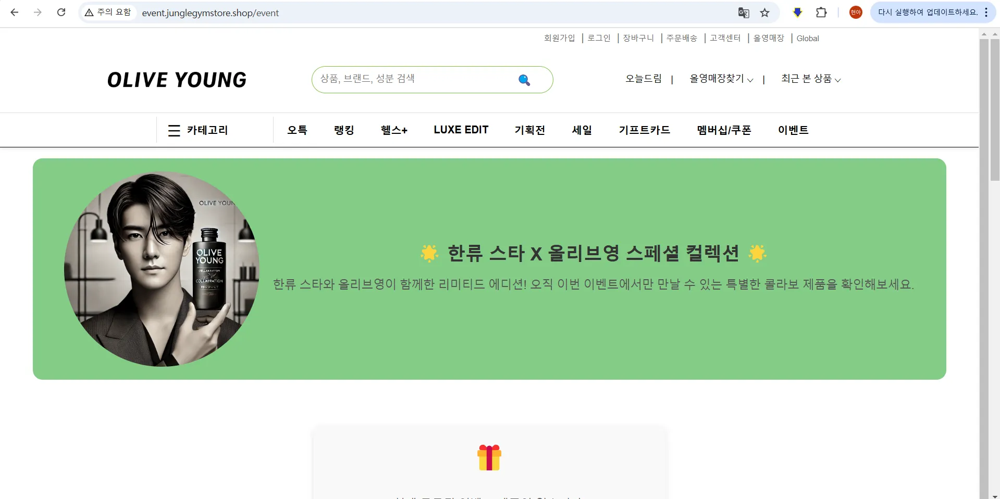
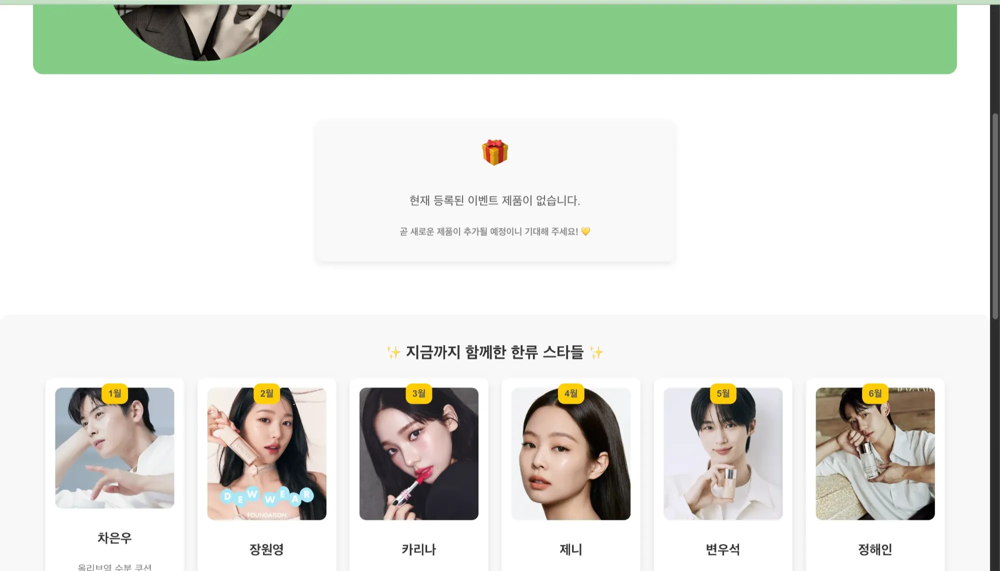
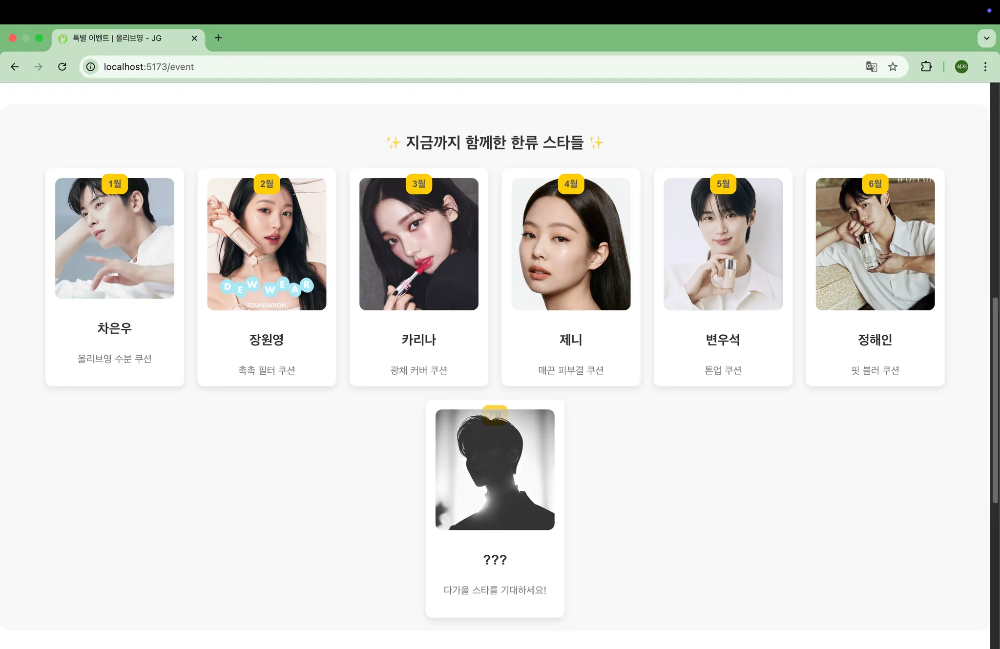

# 🖥️ CJ Jungle Gym - Frontend

> CJ Jungle Gym 프론트엔드 레포지토리입니다.
>
> React + Vite 기반으로 구축되었으며, AWS EKS 및 ECS를 활용한 클라우드 환경에서 운영됩니다.

---

## 📌 **프로젝트 개요**

* **기술 스택**: React, Vite, Axios, AWS Cognito, Docker, Nginx
* **CI/CD 파이프라인**: Jenkins + ArgoCD + AWS ECR
* **배포 환경**:
  * **운영계**: AWS EKS
  * **이벤트계**: AWS ECS
* **특징**:
  * **운영계와 이벤트계를 분리**하여 서비스 제공
  * **AWS Cognito**를 활용한 사용자 인증
  * **Docker** 컨테이너를 활용한 배포 자동화
  * **Nginx** 기반 정적 파일 서빙 및 라우팅 처리
  * 환경 변수 설정을 통해 운영/이벤트 API 분리

---

## 📂 **프로젝트 구조**

```bash
JUNGLE-GYM-FT/
│── public/                 # 정적 파일 (favicon, robots.txt 등)
│── src/
│   ├── assets/             # 이미지, 아이콘 등
│   ├── components/         # 공통 컴포넌트
│   │   ├── Footer.jsx      # 메인 페이지 하단 푸터 컴포넌트
│   │   ├── Header.jsx      # 메인 페이지 상단 헤더 컴포넌트
│   │   ├── tests/          # 컴포넌트 단위 테스트 코드 (Vitest 활용)
│   ├── layouts/            # 공통 레이아웃 컴포넌트 (ex. MainLayout.jsx)
│   ├── pages/              # 라우팅되는 개별 페이지
│   │   ├── Home.jsx        # 메인 페이지 (운영계)
│   │   ├── Login.jsx       # 로그인 페이지 (운영계)
│   │   ├── Event.jsx       # 이벤트 페이지 (이벤트계)
│   │   ├── tests/          # 페이지 단위 테스트 코드 (Vitest 활용)
│   ├── api/                # API 요청 관리 (Axios)
│   │   ├── apiCenter.js    # 운영계 API 관리 (EKS)
│   │   ├── auth.js         # 로그인/회원가입 API 요청 관리
│   │   ├── event.js        # 이벤트계 API 관리 (ECS)
│   ├── routes/Router.jsx   # React-Router 설정 (운영계/이벤트계 라우팅 처리)
│   ├── styles/             # 스타일 파일 (CSS) 및 글로벌 스타일
│   └── main.jsx            # 앱 진입점 (React Root Component)
│── .env                    # 환경 변수 파일 (.env 설정)
│── package.json            # 패키지 정보 및 종속성 관리
│── Dockerfile              # Docker 컨테이너 빌드를 위한 설정 파일
│── nginx.conf              # Nginx 설정 파일 (React 앱 배포 및 404 해결)
│── Jenkinsfile             # CI/CD Jenkins 파이프라인 스크립트
│── vite.config.js          # Vite 설정 파일 (빌드 및 개발 서버 설정)
│── vite.setup.js           # Vite 테스트 환경 설정 (Vitest 등 설정)
│── .gitignore              # Git에 포함하지 않을 파일 설정
│── .dockerignore           # Docker 빌드시 제외할 파일 설정
└── README.md               # 프로젝트 설명 파일 (이 문서)
```

---

## 🌎 **페이지 소개**

각 페이지는 **운영계(EKS)** 와 **이벤트계(ECS)** 로 구분됩니다.

---

### 🏠 **1. 메인 페이지 (운영계)**

**🔗 URL:** [prod.junglegymstore.shop](https://prod.junglegymstore.shop/)

### 🌟운영계 메인 UI

**1️⃣ 메인 페이지 (Header + Footer + Category)**



**(Header + Banner)**



**(Footer)**

**2️⃣ 이벤트 버튼 클릭 (운영 → 이벤트 이동)**



### ✨ **주요 기능**

✔️ 올리브영 홈 화면을 클론 코딩하여 UI 구현

✔️ React Router를 활용한 페이지 이동

✔️ **이벤트 버튼 클릭 시 이벤트계 도메인으로 이동**

```jsx
const handleEventClick = () => {
  window.location.href = "<http://event.junglegymstore.shop/event>";
};
```

---

### 🔑 **2. 로그인 페이지 (운영계)**

**🔗 URL:** [prod.junglegymstore.shop/login](https://prod.junglegymstore.shop/login)

### 🌟운영계 로그인 UI



### ✨ **주요 기능**

✔️ AWS Cognito를 활용한 OAuth 로그인

✔️ 사용자 로그인/로그아웃 기능

---

### 🎉 **3. 이벤트 페이지 (이벤트계)**

**🔗 URL:** [event.junglegymstore.shop/event](https://event.junglegymstore.shop/event)

### 🌟이벤트계 UI

**1️⃣ 이벤트 소개**



**2️⃣ 콜라보 상품 정보 및 한류 스타 리스트**





### ✨ **주요 기능**

✔️ 한류 스타와의 콜라보 제품을 보여주는 페이지

✔️ **ECS 기반 이벤트계 API 연동**

✔️ 운영계에서 클릭 시, 이벤트계 도메인으로 이동

---

## 🚀 **프로젝트 실행 방법**

### 1️⃣ **레포지토리 클론**

```
git clone <https://github.com/CJ-Jungle-gym/Front-end.git>
cd Front-end
```

### 2️⃣ **환경 변수 설정**

`.env` 파일을 프로젝트 루트에 생성하고, 아래 내용을 추가합니다.

```
# 🔗 API 서버 주소
VITE_API_URL=http://k8s-default-olivebac-xxxxxxxx.elb.ap-northeast-2.amazonaws.com
VITE_EVENT_API_URL=http://ecs-alb-xxxxxxxx.ap-northeast-2.elb.amazonaws.com

# 🔐 AWS Cognito 설정
VITE_COGNITO_DOMAIN=https://auth.junglegymstore.shop
VITE_COGNITO_CLIENT_ID=skrs5g7gncsfftpoa6a5qij8f

# 🔄 로그인/로그아웃 리디렉션
VITE_COGNITO_REDIRECT_URI=https://www.junglegymstore.shop/callback
VITE_COGNITO_LOGOUT_URI=https://www.junglegymstore.shop/logout
```

### 3️⃣ **패키지 설치**

```
npm install
```

### 4️⃣ **로컬 서버 실행**

```
npm run dev
```

* 기본적으로 `http://localhost:5173` 에서 실행됩니다.

---

## 🔄 **트러블 슈팅 (Troubleshooting)**

### ❌ **1. 운영계 & 이벤트계 새로고침 시 404 에러 발생**

✅ 해결: **Nginx 설정 수정**

```
server {
    listen 80;
    root /usr/share/nginx/html;
    index index.html;

    location / {
        try_files $uri /index.html;
    }

    error_page 404 /index.html;
}
```

### ❌ **2. 이벤트 버튼 클릭 시 운영계 내부 이동 문제**

✅ 해결: **이벤트 버튼 클릭 시 이벤트 도메인으로 리다이렉트**

```jsx
const handleEventClick = () => {
  window.location.href = "<http://event.junglegymstore.shop/event>";
};
```

### ❌ **3. 운영계 & 이벤트계 라우팅 문제**

✅ 해결: **Router.jsx에서 도메인별 분기 처리**

```jsx
const hostname = window.location.hostname;
const isEventEnvironment = hostname === "event.junglegymstore.shop";

function Router() {
  return (
    <Routes>
      {isEventEnvironment ? (
        <>
          <Route path="/event" element={<Event />} />
          <Route path="*" element={<Navigate to="/event" />} />
        </>
      ) : (
        <>
          <Route path="/" element={<Home />} />
          <Route path="/login" element={<Login />} />
          <Route path="/event" element={<Navigate to="/" />} />
        </>
      )}
    </Routes>
  );
}
```

---

## 🛠 **CI/CD 파이프라인**

### 📌 **GitHub → Jenkins → ECR → ArgoCD → EKS/ECS**

---

## 🚀 **1. CI/CD 전체 흐름**

```
1️⃣ 개발자가 GitHub 레포지토리에 push
   → GitHub Webhook이 Jenkins에 이벤트 전송
2️⃣ Jenkins가 GitHub 레포를 자동 체크아웃 (Checkout)
3️⃣ SonarQube 분석 및 코드 품질 검사 수행
4️⃣ `npm run test` 실행하여 테스트 수행
5️⃣ `npm run build` 실행하여 정적 파일 빌드
6️⃣ Docker 이미지 빌드 및 AWS ECR에 푸시
7️⃣ Trivy를 사용해 Docker 이미지 보안 스캔
8️⃣ ArgoCD가 최신 이미지를 감지하고 EKS/ECS에 자동 배포
```

---

## 📌 **2. CI/CD 동작 방식 및 상세 설명**

### 🔹 **GitHub → Jenkins Webhook 트리거**

* GitHub의 **Webhooks**를 설정하여 `git push` 이벤트가 발생하면 Jenkins가 자동으로 파이프라인 실행
* Jenkins가 **GitHub 레포지토리에서 코드를 가져옴** (`Checkout` 단계)

---

### 🔹 **Jenkins에서 빌드 & 테스트**

Jenkinsfile을 통해 아래의 단계를 수행:

### ✅ **1️⃣ Checkout (Git Pull)**

```groovy
stage('Checkout') {
    steps {
        checkout scm
    }
}
```

* GitHub에서 최신 소스코드를 가져옵니다.

### ✅ **2️⃣ 의존성 설치**

```groovy
stage('Install Dependencies') {
    steps {
        sh 'npm install'
    }
}
```

* `npm install`을 실행하여 필요한 패키지를 설치합니다.

### ✅ **3️⃣ SonarQube 코드 품질 검사**

```groovy
stage('SonarQube Scanner') {
    steps {
        withSonarQubeEnv('jg-sonarqube') {
            sh 'npx sonar-scanner \\
                -Dsonar.projectKey=olive-front \\
                -Dsonar.sources=. \\
                -Dsonar.host.url=http://sonar-LB-1171679121.ap-northeast-2.elb.amazonaws.com \\
                -Dsonar.login=squ_defd65e305f5684bc10dd0e10f936c83ea846f74'
        }
    }
}
```

* **SonarQube 분석을 수행하여 코드 품질을 점검합니다.**
* `sonar.projectKey=olive-front` → 프로젝트 식별
* 코드가 특정 품질 기준을 만족하지 않으면 **빌드 실패 처리**

### ✅ **4️⃣ 테스트 실행**

```groovy
stage('Run Tests') {
    steps {
        sh 'npm run test'
    }
}
```

* **Vitest를 활용하여 테스트를 실행**합니다.
* 테스트 실패 시  **다음 단계로 진행되지 않음** .

### ✅ **5️⃣ React 정적 파일 빌드**

```groovy
stage('Build') {
    steps {
        sh 'npm run build'
    }
}
```

* React 애플리케이션을 빌드하여 `dist/` 폴더 생성.

---

### 🔹 **Docker 이미지 빌드 & ECR 푸시**

Jenkins에서 **Docker 이미지를 빌드하고 AWS ECR에 저장**합니다.

### ✅ **6️⃣ Docker 이미지 빌드**

```groovy
stage('Build Docker Image') {
    steps {
        script {
            docker.withRegistry("<https://$>{ECR_REPO}/", '9b45eaf4-a184-44eb-ba8c-8e20a854de1b') {
                myapp = docker.build('olive-front')
                myapp.push("${IMAGE_TAG}")
            }
        }
    }
}
```

* Docker를 사용하여 프론트엔드 이미지를 빌드 (`docker build`).
* 빌드된 이미지를 AWS **ECR(Elastic Container Registry)**에 푸시.

### ✅ **7️⃣ Trivy 보안 스캔**

```groovy
stage('Scan Image with Trivy') {
    steps {
        script {
            try {
                sh 'trivy image --format template --template "@/root/html.tpl" --output trivy-report.html "${ECR_REPO}:${IMAGE_TAG}"'
                echo "Trivy scan completed"
            } catch (Exception e) {
                echo "Trivy scan failed: ${e.getMessage()}"
                currentBuild.result = 'FAILURE'
                throw e
            }
        }
    }
}
```

* **Trivy를 사용하여 Docker 이미지의 취약점을 검사**합니다.
* 보안 위험이 발견될 경우 **빌드를 중단**하고 문제 해결 필요.

### ✅ **8️⃣ Trivy HTML 리포트 발행**

```groovy
stage('Publish HTML Report') {
    steps {
        script {
            if (fileExists('trivy-report.html')) {
                echo "Trivy report found, publishing HTML report"
                publishHTML(target: [
                    allowMissing: false,
                    alwaysLinkToLastBuild: false,
                    keepAll: false,
                    reportDir: '.',
                    reportFiles: 'trivy-report.html',
                    reportName: 'Trivy Vulnerability Report'
                ])
            } else {
                echo "Trivy report not found, skipping HTML report publishing"
            }
        }
    }
}
```

* Trivy 취약점 검사 결과를 **Jenkins에서 확인 가능하도록 HTML 리포트로 저장**합니다.

---

### 🔹 **ECR → ArgoCD 자동 배포**

Jenkins가 ECR에 **최신 Docker 이미지**를 푸시하면,

**ArgoCD가 이를 감지하여 AWS EKS/ECS에 자동 배포**합니다.

**💡 ArgoCD 자동 배포 동작**

1. ArgoCD가 `ECR`의 최신 이미지를 감지
2. `EKS` 또는 `ECS`의 프론트엔드 컨테이너를 새로운 버전으로 업데이트
3. 배포 후 `ALB`를 통해 사용자 요청을 새로운 컨테이너로 전달

---

## 🔹 **3. Dockerfile (빌드 및 Nginx 설정)**

**React 정적 파일을 Nginx로 서빙하도록 설정**합니다.

```
# 1️⃣ Node.js를 사용하여 빌드
FROM node:18 AS build

WORKDIR /app
COPY package.json package-lock.json ./
RUN npm install

COPY . .
RUN npm run build

# 2️⃣ Nginx로 정적 파일 서빙
FROM nginx:latest
COPY --from=build /app/dist /usr/share/nginx/html
COPY nginx.conf /etc/nginx/conf.d/default.conf

# 환경 변수 설정
ENV PORT=80
EXPOSE 80

CMD ["nginx", "-g", "daemon off;"]
```

✅ **빌드 & 배포 과정**

1. **Node.js**에서 React 애플리케이션 빌드 (`npm run build`)
2. **Nginx** 컨테이너에 정적 파일 복사 (`/dist` → `/usr/share/nginx/html`)
3. **Nginx로 웹서버 실행 (80 포트)**

---

## 🔥 **4. 최종 배포 플로우**

| 단계                           | 수행 작업                                    |
| ------------------------------ | -------------------------------------------- |
| **GitHub Webhook**       | `git push`시 자동으로 Jenkins 트리거       |
| **Jenkins: Checkout**    | GitHub 레포에서 최신 코드 가져오기           |
| **SonarQube 분석**       | 코드 품질 검사                               |
| **Vitest 테스트 실행**   | 프론트엔드 테스트 수행                       |
| **React 정적 파일 빌드** | `npm run build`실행                        |
| **Docker 이미지 빌드**   | React 빌드 파일을 포함한 Nginx 컨테이너 생성 |
| **AWS ECR 푸시**         | 빌드된 이미지를 ECR 저장소로 업로드          |
| **Trivy 취약점 검사**    | Docker 이미지 보안 점검                      |
| **ArgoCD 자동 배포**     | 최신 이미지 감지 후 EKS/ECS로 배포           |

---

## 🎯 **5. 핵심 정리**

✅ **Jenkinsfile을 활용한 CI/CD 자동화**

✅ **ECR에 Docker 이미지 푸시 후 ArgoCD 자동 배포**

✅ **운영계(EKS) & 이벤트계(ECS) 환경에 맞게 배포**

✅ **Trivy로 보안 점검 & SonarQube로 코드 품질 유지**

---

## 📢 **문의**

**개발 관련 문의**는 [GitHub Issues](https://github.com/CJ-Jungle-gym/Front-end/issues)에 등록해주세요.

---

🔗 **CJ Jungle-Gym 프론트엔드 개발팀**
